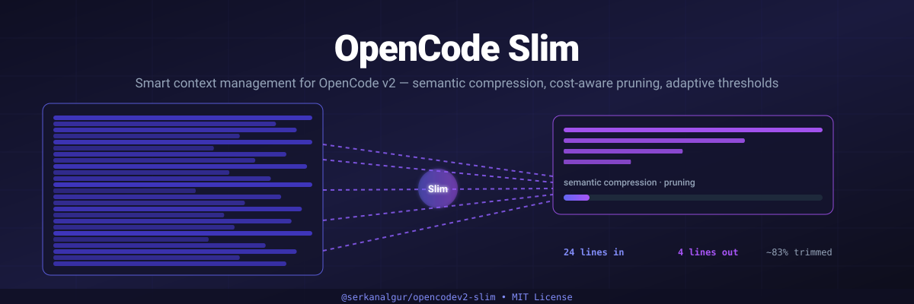

# OpenCode Slim

<div align="center">



[](https://www.npmjs.com/package/@serkanalgur/opencodev2-slim)
[](https://www.npmjs.com/package/@serkanalgur/opencodev2-slim)
[](https://github.com/serkanalgur/opencodev2-slim/stargazers)
[](https://github.com/serkanalgur/opencodev2-slim/blob/main/LICENSE)
[](https://socket.dev/npm/package/@serkanalgur/opencodev2-slim/overview)
[](https://opencode.ai)
[](https://www.typescriptlang.org/)
[](https://github.com/sponsors/serkanalgur)

**Smart context management plugin for OpenCode v2 — semantic compression, cost-aware pruning, adaptive thresholds**

[Installation](#installation) • [Usage](#usage) • [Features](#features) • [Configuration](#configuration) • [How It Works](#how-it-works) • [Commands](#commands) • [Changelog](#changelog)

</div>

---

## Features

- **TUI Panel** - Rich context usage visualization with status indicators
- **Enhanced Compress** - Auto/range/topic modes for flexible compression
- **Semantic Compression** - Groups related tool calls and compresses them intelligently
- **Cost-Aware Pruning** - Considers token pricing when deciding what to compress
- **Adaptive Thresholds** - Learns from compression history to optimize timing
- **Session Persistence** - Saves state across restarts
- **Deduplication** - Removes repeated tool calls automatically
- **Error Purging** - Cleans up failed tool call outputs after configurable turns
- **Tool-Output Pruning** - Replaces old, large tool-result payloads on the outgoing request (opt-in, off by default)
- **Measured vs Estimated Tokens** - Merges the server's real usage with a full-prompt estimate, and labels which one the panel is showing
- **Topic Extraction** - Identifies and tracks conversation topics
- **Smart Recommendations** - Provides actionable suggestions for context optimization

## Installation

```bash
opencode plugin @serkanalgur/opencodev2-slim@latest --global
```

This installs the plugin globally. The TUI features (panel, slash commands) are automatically loaded when OpenCode starts.

### Manual Installation

If the CLI command doesn't work, add to your `~/.config/opencode/opencode.json`:

```json
{
  "plugins": ["@serkanalgur/opencodev2-slim"]
}
```

## Usage

### Slash Commands

After installation, these slash commands are available in the TUI:

- `/panel` — Context window panel in a dialog: message/token breakdown for the
  active context, the resolved compression trigger, and live measurements
- `/compress` — Sends the assistant a compression instruction (see below)
- `/status` — One-line context health report (tokens / limit / %, model, cost)
- `/slim-debug` — Toggles `debug` in `~/.config/opencode/slim.jsonc`

`/panel`, `/status` and `/slim-debug` are display-only: they render through
`context.ui.dialog.alert` and never append anything to the session transcript.
`/compress` is the exception — it is a deliberate instruction to the model.

### TUI Panel

`/panel` prints:

- Session id and the scope of the numbers — they come from
  `session.context`, i.e. **messages since the last compaction**, not session
  totals. The panel states this on a `Scope:` line.
- Message breakdown by role (user/assistant/system), tool calls, and
  compactions within that scope
- Estimated tokens per role plus a total estimate
- The resolved compression trigger, as a token count and as a percentage of the
  context window, then the floor on a continuation line —
  `Trigger: … tokens (…% of … window)` followed by `floor …` — the same two
  lines the `panel` tool prints
- Live measurements: tokens, usage %, status, cost, model

### `panel` tool

The `panel` tool prints a richer, boxed report. Two lines make the numbers
self-explanatory:

- `Source: measured (server-reported)` / `Source: estimated (approximate)` —
  where the headline `Context` token figure came from (see
  [Measurement trust](#measurement-trust-usage)). An estimate is a magnitude,
  not an exact count.
- `Prune: N outputs · ~X chars (~Y tokens)`, with the caveat
  `saved on the last request only, not cumulative` on a continuation line —
  tool-output pruning activity from the most recent request. It is a
  *per-request* figure (the plan is re-applied every request), not a cumulative
  saving, and the line appears only when pruning is enabled or the last request
  actually pruned something.

### Compress Tool

The enhanced compress tool supports multiple modes:

```typescript
// Auto mode (default) - intelligently selects what to compress
compress({ focus: "old exploration" })

// Range mode - compress specific message range
compress({ focus: "completed tasks", mode: "range", start: 0, end: 50 })

// Topic mode - compress messages matching a topic
compress({ focus: "database work", mode: "topic", topic: "database" })
```

#### `/compress` delivery

`/compress` does not compress anything itself — it writes a short instruction
(the focus/mode/keep-recent you passed) into the transcript so the assistant
calls the `compress` tool. Because the point is to make the model act *now*,
the synthetic message is sent with an explicit `delivery: "steer"`:

- **`steer` (chosen)** — delivered immediately: it interrupts an in-flight turn,
  and `session.synthetic` wakes an idle session (`resume` stays at its default
  `true`). This matches both the server default (`delivery ?? "steer"`) and the
  TUI's own default prompt delivery, so `/compress` behaves like typing a
  message.
- **`queue` (rejected)** — a queued item is only taken when the runner is not
  already consuming a turn, so the instruction would wait for the next user
  turn instead of compressing now.

`/panel`, `/status` and `/slim-debug` write nothing to the session.

## Configuration

Create `~/.config/opencode/slim.jsonc`:

```jsonc
{
    "enabled": true,
    "compress": {
        "enabled": true,
        "permission": "allow",
        // Absolute token count (e.g. 200000) or percent of the model context
        // window ("80%"). Broken values fall back to the default, never 0.
        "maxContextLimit": "80%",
        "minContextLimit": "40%",
        "nudgeFrequency": 5,
        "protectUserMessages": false,
        "protectedTools": ["task", "skill", "todowrite", "todoread"]
    },
    "strategies": {
        "deduplication": {
            "enabled": true,
            "protectedTools": []
        },
        "purgeErrors": {
            // OFF by default. In 3.0.2 this was configured as `true` but
            // matched nothing, because it looked for the pairing id on
            // `toolCallID`/`callID` while the id lives on `part.id` — see
            // "Purge-errors migration" below before turning it on.
            "enabled": false,
            "turns": 4,
            "protectedTools": []
        },
        // OFF by default. When enabled, replaces the payload of old, large,
        // non-protected tool results on the outgoing request only.
        "pruneOutputs": {
            "enabled": false,
            "minChars": 2000,
            "maxPerRequest": 50,
            "protectedTools": []
        },
        // Never prune a tool result produced within the last `turns` turns.
        "turnProtection": {
            "enabled": true,
            "turns": 4
        },
        // ON by default, escape hatch only. Set to false only if you have a
        // reason to: it lets a range split a tool pair again, and the provider
        // will reject the next request with `invalid_request_error`.
        "guardToolPairs": true
    },
    // Measured-vs-estimated token accounting (see "Measurement trust" below).
    "usage": {
        "trustRatio": 0.5,
        "capRatio": 3
    },
    "adaptive": {
        "enabled": true,
        "learningRate": 0.1,
        "minCompressionRatio": 0.3
    },
    "costAware": {
        "enabled": true,
        "cacheBoostFactor": 0.5
    },
    "persistence": {
        "enabled": true,
        "directory": "~/.config/opencode/slim"
    }
}
```

### Context thresholds

`compress.maxContextLimit` and `compress.minContextLimit` (and their per-model
overrides `compress.modelMaxLimits` / `compress.modelMinLimits`, keyed
`"providerId/modelId"`) accept two forms:

| Form | Example | Meaning |
| --- | --- | --- |
| Number | `200000` | Absolute token count — triggers once the session reaches 200k tokens. |
| Percent string | `"80%"` | Percentage of the model's context window (80% of 200k = 160k tokens). |

Percent strings accept a decimal comma for locale-typed configs: if the plain
parse fails, every comma is retried as the decimal separator, so `"80,5%"`
means 80.5% of the window (write absolute counts as JSON numbers — thousands
separators are not supported). A value that still cannot be parsed falls back
to the built-in default with a console warning, deduplicated per
(config key, issue, offending value) — repairing a value and breaking the key
again with a *different* bad value warns again.

Values that cannot be used (unparsable, negative, or a percent while the model
window is unknown) fall back to the built-in default (`100000` / `50000`) with a
one-time console warning — never to `0`, which would disable triggering. An
absolute threshold above the context window is clamped to that window so it can
still fire. Both panel surfaces — the `panel` tool and the TUI `/panel` dialog —
show the resolved trigger as a token count and as its percentage of the window
(`Trigger: … tokens (…% of … window)`), with the floor on its own continuation
line (`floor …`), and with the percentage omitted when the window is unknown.

**What the threshold is actually compared against.** `maxContextLimit` /
`minContextLimit` are compared against the size of the **outgoing prompt we are
about to send** — the real measured usage of the last completed request when the
provider reported one, otherwise a full-prompt estimate (system prompt, tool
schemas, message text, tool-call inputs and tool results). They are **never**
compared against the session's lifetime cumulative token counter, which grows
without bound because `cache.read` re-reads the whole context every turn. The
`panel` reflects this split explicitly:

- `Context: [█…] …%` (the bar) is the **current prompt size** — the figure the
  threshold applies to, with its magnitudes on the continuation line
  `… / … tokens`.
- `Lifetime: … tokens · cumulative spend, NOT context size` is the separate
  lifetime total (`Session.Info.tokens`), shown only when it differs from the
  prompt size. It is a cost statistic, not occupancy.

The `Context` figure also carries a `Source:` line naming where it came from —
see [Measurement trust](#measurement-trust-usage) below.

### Tool-output pruning and turn protection

`strategies.pruneOutputs` replaces the *payload* of old, large, non-protected
tool results (e.g. a huge `read`, `grep` or `bash` output) with a short
placeholder **on the outgoing request only** — session history is never touched.
It is **OFF by default** (`enabled: false`): pruning rewrites an earlier part of
the prompt and therefore invalidates the provider's prefix cache, so it costs a
one-time full-price request per newly pruned turn.

| Key | Default | Meaning |
| --- | --- | --- |
| `pruneOutputs.enabled` | `false` | Master switch. Opt-in; an absent block leaves the prompt untouched. |
| `pruneOutputs.minChars` | `2000` | Minimum serialized size (characters) for an output to be eligible. |
| `pruneOutputs.maxPerRequest` | `50` | At most this many outputs pruned per request. Never splits a turn. |
| `pruneOutputs.protectedTools` | `[]` | Extra tool names kept, on top of the always-protected set (`task`, `skill`, `todowrite`, `todoread`, `write`, `edit`, …). `purgeErrors.protectedTools` is folded into this set too. It says nothing about errored results: those are never pruned, whatever the list says. |
| `turnProtection.enabled` | `true` | Keep the most recent turns intact. |
| `turnProtection.turns` | `4` | Number of recent turns never pruned — the working set the model is actively using. |

Because the prune plan is rebuilt and re-applied on **every** request, any
saving it produces is a *per-request* figure, not a cumulative or permanent one.
The `panel` tool states this on its `Prune:` block
(`Prune: … outputs · … chars (… tokens)` followed by
`… saved on the last request only, not cumulative`) and shows it only when
pruning is enabled or the last request actually pruned something; with the
default (off) the block is absent.

### Purge-errors migration

`strategies.purgeErrors` used to default to `enabled: true`, and if you never
wrote the key into `slim.jsonc` you were running it. It did nothing. The
strategy matches an errored tool result to its call, and it was reading the
pairing id from `toolCallID` / `callID` — fields that do not exist on the v2
message shape, where the id lives on `part.id`. Every lookup came back empty, so
the purge never fired, on any request, for any session.

The lookup is fixed, which means the strategy now does what its name says: for
a tool call whose result errored, and which is at least `turns` positions behind
the end of the conversation, every string value longer than 80 characters in its
`input` is replaced with `[input removed due to failed tool call]`. The error
itself and the rest of the input are kept.

Because that is a visible change to the outgoing prompt from a path that had
never executed, the default is now `enabled: false`.

- **You never set the key.** Nothing changes for you. It stays off until you ask
  for it.
- **You set `purgeErrors.enabled: true` explicitly.** It now works. Expect the
  rewritten inputs described above on the first request after upgrading, and
  check that losing those long input values does not break anything you rely on
  for error recovery — a failed call is exactly the one you may want to re-read.

The purge and the [Tool-pair guard](#tool-pair-guard) both act on
`event.messages` in the same context hook, so enabling one does not leave the
other passive: whatever the guard is protecting, the purge is rewriting.

`purgeErrors.protectedTools` is the escape hatch for that. A tool named there is
skipped on both sides of a pair: its errored result never registers the call as
a purge candidate, and the rewrite pass re-checks the name before touching the
`input`. Because the two sides can carry the name differently, the name is read
per part — `name` on the v2 `tool-call` / `tool-result` parts, `tool` on the v1
`{ type: "tool" }` part — and falls back to the other side of the pair. If
neither side carries a name, the tool is **not** protected: an unknown name is
not in your list, and silently sparing every nameless tool would make the purge
appear to do nothing.

| Key | Default | Meaning |
| --- | --- | --- |
| `purgeErrors.enabled` | `false` | Master switch. Opt-in after 3.0.2. |
| `purgeErrors.turns` | `4` | A call is only purged once it is at least this many messages from the end. |
| `purgeErrors.protectedTools` | `[]` | Tool names exempt from the purge: an errored call to one of these keeps its `input` verbatim. Only the **input** is spared — the error message itself is never rewritten, and an errored result's output is never pruned by anything. The list is also folded into `pruneOutputs.protectedTools`, so it additionally protects that tool's *successful* outputs from size-based pruning. A tool whose name cannot be read from either side of a pair is **not** protected. |

### Tool-pair guard

Compression blocks and deduplication both drop *whole* messages, which can
split a tool call from its result. The host repairs one direction of that split
(it synthesises `Tool result missing` for a surviving call) but not the other: a
surviving `role:"tool"` result whose call is gone is emitted with an orphan
`tool_call_id` and the next request fails with `[invalid_request_error] invalid
request`.

`strategies.guardToolPairs` therefore forbids removing a `tool-call` whose
`tool-result` is not removed by the same pass. It is **ON by default**; set it
to `false` only as an escape hatch, because turning it off on a range that
splits a pair restores the 400. A block whose covered range ends up entirely
locked by the guard is skipped altogether rather than injecting a summary with
no removal behind it.

The summary itself is injected as a `role:"user"` message wrapped in a
`<conversation-checkpoint>` envelope, so the model can see where the replaced
range began and ended. The tags are part of what your model reads on every
compressed turn — mention them if you need to.

Nothing the guard does can be undone by the
[Purge-errors migration](#purge-errors-migration), because that one rewrites
`input` values in place and never removes a message — it leaves every pairing
intact. Order only matters when you are debugging: the guard runs first, on the
unpurged messages.

| Key | Default | Meaning |
| --- | --- | --- |
| `guardToolPairs` | `true` | ON by default, escape hatch only. Never remove a message carrying a `tool-call` whose `tool-result` survives. Applies to compression blocks and deduplication; anything other than an explicit `false` counts as on. |

### Measurement trust (`usage`)

The trigger merges two independent numbers:

- **measured** — what the provider actually reported for the last completed
  request (`session.step.ended`: `input + output + reasoning + cache.read +
  cache.write`). Exact for that request, but it describes the *previous* prompt,
  so it goes stale the moment pruning/compression shrinks the next one.
- **estimated** — a character-count approximation of everything on the wire for
  *this* request (system prompt, tool schemas, text, reasoning, tool-call inputs,
  tool results, compaction summaries), divided once by ~4 chars/token. No
  tokenizer is invoked, so it is a magnitude, not an exact count.

Neither is safe alone, so the two are clamped in both directions:

| Key | Default | Meaning |
| --- | --- | --- |
| `usage.trustRatio` | `0.5` | A measurement below this fraction of the estimate is treated as stale and the **estimate** wins. |
| `usage.capRatio` | `3` | A measurement above this multiple of the estimate is treated as a broken reading and **capped** at `capRatio × estimated`. |

Both fields are optional and fall back to the defaults, so an absent block is
safe. The `panel`'s `Source:` line reports where the panel's **own headline
figure** came from — `measured (server-reported)` when the server reported usage
for that request, otherwise `estimated (approximate)` — so an approximation is
never mistaken for an exact count. It does **not** replay the merge above: the
trigger applies its own `trustRatio`/`capRatio` rules to the measured *total*
(`input + output + reasoning + cache.read + cache.write`) against the
outgoing-prompt estimate, a different quantity from the panel's `Context` figure.
The panel's `Context:` line is the last request's prompt size
(`input + cache.read + cache.write`) and its `Lifetime:` line is the session's
cumulative spend; the two are never mixed, and `Source:` labels only the
`Context` figure.

Global limits are only resolved when they are actually needed: a model with a
valid `compress.modelMaxLimits` / `compress.modelMinLimits` override never
reads — and never warns about — the global `maxContextLimit` /
`minContextLimit`. The fallback chain itself is unchanged and covered by the
test suite: a broken per-model override degrades to the *configured* global
(not straight to the built-in default), a broken global degrades to the
built-in default, and warnings fire once per (key, issue, value) across
repeated calls.

## How It Works

### Semantic Compression

Unlike simple text truncation, slim analyzes the semantic content of messages and groups related tool calls together. This preserves context while removing redundancy.

### Cost-Aware Pruning

Slim considers the cost of tokens when deciding what to compress. It prioritizes compressing expensive operations (like large file reads) while preserving cheap but important context.

### Adaptive Thresholds

The plugin learns from your compression patterns and adjusts thresholds over time. If you tend to need more context, it will compress less aggressively. If you're efficient, it will compress more.

### Session Persistence

State is saved to disk, so compression history and learning persist across restarts.

## Commands

| Command | Description |
|---------|-------------|
| `/panel` | Open the Slim TUI panel in a dialog with context usage, stats, and trigger thresholds |
| `/compress` | Send the assistant a compression instruction (`delivery: "steer"`) |
| `/status` | Show a one-line context health report in a dialog (never written to the session) |
| `/slim-debug` | Toggle `debug` in `~/.config/opencode/slim.jsonc` and show the result in a dialog |

Note: Compression is performed by the AI assistant using the `compress` tool. The slash command provides guidance on usage; it is the only slash command that writes to the session, and it does so with an explicit `delivery: "steer"` (see [Compress Tool](#compress-tool)).

## Changelog

### 3.0.4

**FIXES**

- `strategies.purgeErrors.protectedTools` now protects the tool's input. The
  option was documented but never consulted on the input side, so a tool named
  there still had the input of its failed call rewritten. It is honoured now, on
  every message shape. Note that the list is also folded into output pruning, so
  naming a tool here exempts it from the errored-input purge *and* from
  size-based output pruning of its successful results.
- A tool whose name cannot be determined on a message part is now purged rather
  than protected, so opting a tool in can never turn into a purge that silently
  does nothing.
- Two panel lines no longer overflow the panel frame. The compression-trigger
  line and the pruning line were each split across two lines so every value fits;
  nothing was dropped and nothing was truncated. The trigger's floor and the
  pruning line's "last request only, not cumulative" caveat each moved to a
  continuation line, and both are still shown.

**NEW**

- Panel overflows from unbounded text are now disclosed rather than hidden. The
  model id, topic name and recommendation lines are emitted from unbounded
  server- or user-supplied strings and can exceed the frame at extreme lengths.
  They are not truncated — that is a deliberate decision deferred to a later
  change — but the exception is now recorded in the test suite with its reason,
  so a future change that fixes one of them cannot happen silently.

**DOCS**

- Corrected two panel-output descriptions that did not match what the renderer
  actually emits. A test now extracts the README's quoted output and checks it
  against rendered output, so this class of documentation drift fails the build
  instead of accumulating.

### 3.0.3

**BREAKING CHANGES**

- `strategies.purgeErrors` now defaults to `enabled: false`. The strategy was
  configured to run but could not match a call to its errored result: it read the
  pairing id from `toolCallID` / `callID`, fields the v2 message shape does not
  carry, so every lookup came back empty and the purge never fired on any
  request. The lookup is fixed, and because it rewrites the outgoing prompt from
  a path that had never executed, it is now opt-in. If you set the key
  explicitly you get the working behaviour; if you never set it, nothing changes
  for you until you ask for it — see
  [Purge-errors migration](#purge-errors-migration).

**FIXES**

- Compression summaries no longer leave out the output half of a protected tool.
  The same lookup bug meant `part.output` was silently missing from every
  protected tool's section, so restoring it exposed a section bounded only by the
  tool's own output size. The section is now capped and says so when it has been
  truncated, so a compression is always smaller than the range it replaced.
- Compression statistics can no longer report a negative saving. If a summary
  ends up larger than the range it replaces, the recorded saving is now `0%`
  rather than a negative figure, and the panel no longer prints negative tokens
  or a negative dollar amount saved. A compression that does not shrink is not a
  saving.
- A very large token count is no longer rendered as a string that overflows the
  panel. The token formatter was duplicated in two files and scaled in a single
  step, so a large value printed as a ten-character run that broke out of the
  panel frame. It is now one implementation with progressive units; values below
  a billion are formatted exactly as before.

**NEW**

- The README banner is now included in the published package, so it renders on
  npmjs without relying on npm to rewrite a relative image path.

**DOCS**

- Documented the `purgeErrors` opt-in default in
  [Purge-errors migration](#purge-errors-migration), alongside the
  [Tool-pair guard](#tool-pair-guard) it interacts with on the same messages.

### 3.0.2

**FIXES**

- A compressed message range could leave a tool result behind without the tool
  call that produced it, and the next model request was rejected with
  `[invalid_request_error] invalid request`. The covered range was selected on
  token size, and a message carrying only tool calls counts as zero text tokens —
  so such a message fell outside the range while its (large) tool result fell
  inside it, leaving an orphaned `tool_call_id` on the wire. This affected the
  `compress` tool and automatic compression alike.
- Compression no longer breaks a tool call/result pair. The rule is
  one-directional: a tool call may only be removed when every tool result
  carrying the same id is removed by the same pass. A surviving call whose result
  is missing is repaired by the host, but a surviving result whose call is
  missing is not. A block whose covered range ends up removing nothing is
  skipped entirely rather than injecting its summary, so compression can never
  grow the prompt.
- The same protection now applies to output deduplication, which could orphan a
  tool pair the same way.
- Sessions compressed by an earlier version are repaired automatically. The
  protection is applied when the request is built, so a block registered before
  the fix that covers a broken range is corrected on the next request — no state
  reset and no manual intervention.
- The injected summary is now wrapped in a `<conversation-checkpoint>` envelope,
  so the model can see where the replaced range began and ended.
- Session state is more robust against a corrupt or hand-edited state file:
  malformed compression-block entries are dropped on load and the file heals
  itself, the block-id counter can no longer be reset into a collision with an
  existing block, and a failure inside the compression step is rolled back
  instead of leaving half-applied state on disk.

**NEW**

- `strategies.guardToolPairs` (default **on**) is the escape hatch for the pair
  protection described above. Turn it off only if you are debugging the guard
  itself — see [Tool-pair guard](#tool-pair-guard) for the full semantics.

### 3.0.1

**FIXES**

- The context window is no longer resolved by borrowing an arbitrary model's
  limit. When the active model is not found in the model list, the resolver no
  longer falls back to "the first listed model with any limit"; it now uses the
  active model's `default()` limit and, failing that, the documented
  `DEFAULT_MODEL_LIMIT` with a warning. A usage percentage computed against
  another model's context window is meaningless. The TUI's resolver was
  tightened the same way, from a modelID-only match to an exact
  providerID+modelID match.
- The panel and TUI no longer fall back to the lifetime-cumulative token counter
  when showing how full the context window is. When the transcript carries no
  per-call prompt measurement, the displayed occupancy now falls back to our own
  per-message transcript estimate rather than the session's cumulative total —
  which grows every turn, because `cache.read` re-reads the whole context, and
  which therefore produced bogus "100% critical" readings. The cumulative figure
  is still reported where it is legitimate (as lifetime spend/cost) and is still
  explicitly labelled as not being a context size. The `status`/`CRITICAL`
  derivation is now clamped to 0..100.
- The welcome toast no longer reports a stale version. The `Slim Plugin vX.Y.Z`
  title was a hardcoded literal that had drifted to `v2.1.0`; it is now derived
  from a single `PLUGIN_VERSION` constant, guarded by a test that keeps it in
  sync with `package.json`.

**DOCS**

- Refreshed the README: banner, badge row, and a `## Credits` section.

### 3.0.0

**BREAKING CHANGES**

- The compression trigger threshold is now compared against the outgoing
  prompt's measurement/estimate. The old `Session.Info.tokens` lifetime
  cumulative cost counter is no longer used to decide the trigger, so existing
  config files with tuned `maxContextLimit`/`minContextLimit` can behave
  differently and may need re-tuning. In the panel, `Context:` is the last
  request's prompt size (`input + cache.read + cache.write`) and `Lifetime:` is
  the session's cumulative spend; the two are shown separately. When the
  transcript carries no per-turn usage the old figure is still shown, explicitly
  labelled as lifetime cumulative.
- `/panel`, `/status` and `/slim-debug` no longer write to the session (no
  transcript message); their output is shown in a modal dialog
  (`context.ui.dialog.alert`). Previous versions wrote the output into the
  message stream. Only `/compress` still writes (it is an instruction to the
  model) and now passes an explicit `delivery: "steer"` instead of relying on
  the server default.

**FIXES**

- Session corruption: removed v1 API remnants (`client.session.synthetic`,
  `data.session.message.*`) and migrated to the OpenCode v2 API.
- Compression blocks did not work in production: in the v2 context hook,
  messages have no `id` field, so the old code always found an empty id and
  deleted every block. Now uses deterministic content-based key generation plus
  an ambiguity lock.
- The token metric only counted text parts (tool input/output, system prompt,
  tool schemas and reasoning were not counted), so auto-compress effectively
  never triggered. Now uses the real API measurement (`session.step.ended`) plus
  a full-prompt-scoped estimate.
- In v2 a tool result is an array of content blocks, not a string; `String()`
  produced `[object Object]`.
- The panel threw `RangeError` when above 100% (negative repeat on a full bar).
- An invalid threshold value silently fell back to 0, so the trigger never
  fired. It now falls back to the default and emits a warning.
- Context-window resolution: the model list was called without `await`, so it
  always fell back to 200000.
- Decimal comma support (`80,5%`).

**NEW**

- `maxContextLimit`/`minContextLimit` accept absolute token counts (a bare
  number); percentage forms (`80%`, `80,5%`) keep working.
- `strategies.pruneOutputs` prunes tool output (default OFF, opt-in) with turn
  protection. Auto-compress keys are captured **before** pruning replaces pruned
  messages with clones, so pruning no longer desynchronises the persisted
  compression block's anchors from the messages it covered (which left the block
  inert and re-triggered every throttle window).
- `usage.trustRatio` / `usage.capRatio` measurement-trust settings.
- State reset after compaction (`compressionBlocks`, nudge anchors, token
  measurement).
- The panel shows a `Source: measured (server-reported)` line (or
  `Source: estimated (approximate)`) and prune statistics. The
  `Source:` line describes where the headline figure came from —
  `measured (server-reported)` when the server reported usage, otherwise
  `estimated (approximate)` — so an approximation is never read as an exact
  count. The `Prune:` line reports outputs pruned and characters/tokens saved on
  the last request (a per-request figure, since pruning is re-applied every
  request; the line is absent while the default-off feature has not pruned
  anything).
- `/panel` states its scope: the stats come from `session.context` ("all
  messages after the last compaction"), so `Messages:`/`Tokens (est)` are window
  counts, not session totals, and it now shows the resolved compression trigger
  over two lines (`Trigger: … tokens (…% of … window)` then `floor …`),
  matching the `panel` tool.
- `deriveStats` counts unknown message types (`agent-switched`, `model-switched`,
  `location-switched`, `idle`, …) as `system` instead of `assistant`, keeping
  `user + assistant + system === total messages`.
- Documented `strategies.pruneOutputs` (off by default) and
  `strategies.turnProtection` in the config reference, plus the `usage`
  measurement-trust ratios (`trustRatio` / `capRatio`), and clarified that
  `maxContextLimit` is compared against the outgoing prompt estimate/measurement
  — not the lifetime cumulative counter.

### 2.0.13

- Fix `/panel` in the TUI not reflecting real context usage:
  - The TUI command now reads live server measurements (`Session.Info.tokens` + `cost` + `model` + context window) via `context.client.session.get()` and prints them (measured tokens, %, cost, model) at the bottom of the panel, matching what the `panel` tool reports.
  - Resolve the active session from `context.ui.router.current()` instead of a non-existent `context.router`, so the panel targets the focused session rather than always the first one.
  - Call `context.data.session.message.sync()` before reading the transcript so stats aren't computed from an empty/stale cache.

### 2.0.12

- Bind panel/nudge to real OpenCode context measurements:
  - Resolve the active model's real context window from `ctx.model.default().data.limit.context` instead of the hard-coded 200k.
  - `/panel` now reads live server measurements (`Session.Info.tokens` + `cost`) via `ctx.session.get()` and feeds them to `buildPanelData`, so the headline tokens/percent/cost match what OpenCode's UI reports.
  - The nudge decision prefers the measured token count over the rough 4-char estimation.

### 2.0.11

- Fix CI publish: add `solid-js`, `@opentui/core`, `@opentui/solid` to `devDependencies`.
  The workflow runs `npm ci --legacy-peer-deps`, which skips peer deps, so loading
  `@opencode/plugin/tui` failed with `Cannot find package 'solid-js'`.

### 2.0.10

- Fix `/panel` output showing `User tokens: 0`: user/system messages carry their text
  on a top-level `text` field (not inside `content`), which `deriveStats` now captures.
- Add regression tests for CLI panel stats.

### 2.0.9

- `feat(panel-as-message)`: `/panel` and `slim-panel` now print the context stats as plain
  text into the message stream via `client.session.synthetic`, instead of taking over
  OpenCode's own panel UI (`session.panel` slot + `ui.panel.open` removed).
- The TUI panel now derives its own stats (token estimate, role breakdown, tool/compaction
  counts) directly from the session transcript rather than deferring to the server tool.

### 2.0.8

- Fix `keymap.provider is missing` in the CLI plugin: register the keymap layer inside
  an `app` slot render (where the keymap provider is available) instead of in `setup()`.

### 2.0.7

- Fix `Cannot find package 'react'` when the plugin is loaded from the global npm cache:
  add a per-file `/** @jsxImportSource @opentui/solid */` pragma to `src/tui.tsx` so JSX
  always compiles against `@opentui/solid/jsx-runtime`
- Ship `tsconfig.json` in the published package so loaders that read `jsxImportSource` from config pick it up

### 2.0.6

- Add real `compaction` hook so history actually shrinks (the `context` hook only affects the outgoing request)
- Resolve the active model's real context limit instead of hard-coding 200k
- Register `compress`/`panel` tools with `options.codemode` so they appear in agent/codemode environments
- Fix token-by-role panel bug where `tools` always equalled zero
- Replace toast-only CLI panel with a real `session.panel` slot (`slim-panel` / `/panel`)
- Add regression test for the tool-token bucket

### 2.0.3

- Fix v2 API compatibility issues
- Remove namespace from tool registration
- Handle both v1 and v2 message part types
- Make context hooks synchronous

### 2.0.2

- Update README documentation
- Add GitHub Actions workflow for automated npm publish

### 2.0.1

- Fix npm publish conflict

### 2.0.0

**Breaking Changes:** Migrated to OpenCode v2 plugin API.

- Migrate from `@opencode-ai/plugin` to `@opencode/plugin`
- Use `Plugin.define()` pattern instead of server function
- Register tools via `ctx.tool.transform()` with JSON Schema input
- Replace experimental hooks with `ctx.session.hook()`
- Replace event callback with `ctx.event.subscribe()`
- Update cleanup to use setup return function
- Minimum OpenCode version: 2.0.0

### 1.0.1

- Initial release

## Credits

- [PrakharSrivastav](https://github.com/PrakharSrivastav) — reported [issue #11](https://github.com/serkanalgur/opencodev2-slim/issues/11), suggesting that a context window should not be resolved by borrowing an arbitrary model's limit, and that current context usage should be measured per model call rather than read off session lifetime totals. Both suggestions shipped in 3.0.1.

## License

MIT
